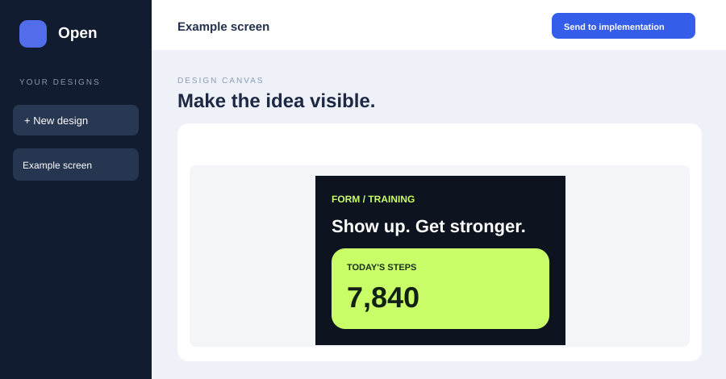

# Open Design Studio

A local visual workspace for drafting app and website screens before implementation. It runs in its own browser window, stores designs on your computer, and exports an approved design package that a coding assistant can build from.



## Features

- Create multiple projects and screens. Duplicate a screen to keep layouts consistent.
- Start from 12 editable templates: Blank, Mobile app design, Slides, Document, Wireframe, Animation, UI mockups, Résumé, 3D object, Research, HTML email, and Color + type pairing.
- Define project-wide colors, typography, spacing, and corners. New elements use shared styles, and linked elements update when the system changes.
- Write a guided brief covering goal, audience, layout, and content.
- Edit text, position, size, color, and corners on a draggable canvas. Add element comments and use undo/redo for focused changes.
- Switch between mobile and desktop canvas sizes.
- Fit the selected canvas inside the editor while keeping its original export dimensions; dragging stays accurate at reduced zoom.
- Save named versions and restore the latest version.
- Review and export the **latest saved version** of every screen as `design.json`, `preview.html`, and `IMPLEMENT.md`.
- Copy an implementation prompt into a Codex task or another coding assistant.

Templates are editable starting layouts. Animation creates storyboard frames, and 3D object creates concept views; the canvas does not render motion or 3D models. Template projects retain their intended canvas size, and newly added screens inherit that size. The fit percentage shown below the canvas affects only the editor view, not the saved design or export. This release does not generate designs from prompts, connect to live app data, or automatically message a Codex task. On blank and legacy projects, switching between mobile and desktop changes the selected screen's canvas size; it does not automatically rearrange elements. Existing designs open with their original visual properties, while new elements can use shared styles.

## Requirements

- Node.js 20 or newer. No npm dependencies are needed.
- A modern browser on Windows, macOS, or Linux.

## Start

Clone this repository, then run:

```sh
git clone https://github.com/BihgJosh/open-design-studio.git
cd open-design-studio
npm start
```

Open **http://127.0.0.1:4177**. On Windows, you can also run `Start Design Studio.ps1` from PowerShell. To use another port, set the `PORT` environment variable before starting Node.

```powershell
$env:PORT = 4180
npm start
```

The server listens on `127.0.0.1` only. It is intended for personal local use; it has no account system or network access controls.

## Design and handoff workflow

1. Press **New design**, choose a template, and fill in the **Brief** tab.
2. Set colors, type, spacing, and corners in the **System** tab.
3. Add screens. Add text, buttons, or blocks; drag elements and use **Edit** for precise changes and element comments.
4. Press **Save version** when the whole project is ready.
5. Press **Send to implementation**, then **Review export** to inspect the exact approved version. The package appears in `handoffs/<design-name>-<id>/`.
6. Copy the generated prompt into your Codex implementation task. The task can read the package files from the same computer.

Only the latest saved version is exported. Later draft changes stay in the studio until you save another version. The preview is a static layout reference, not a functioning app.

## Where your work is saved

| Path | Purpose |
| --- | --- |
| `data/projects.json` | All designs and version history |
| `handoffs/` | Exported implementation packages |

Both paths are ignored by Git so personal designs do not enter a public repository. To back up or move your work, close the server and copy `data/projects.json` to a safe location. To restore it, put that file in the `data/` directory before starting the server. Exported handoffs can be copied separately.

## Contributing

Issues and pull requests are welcome. Please keep designs in `data/` and exports in `handoffs/` out of commits. Run `npm test` before submitting a change. The project uses Node's built-in modules and plain HTML, CSS, and JavaScript.

## License

MIT. See [LICENSE](LICENSE).
